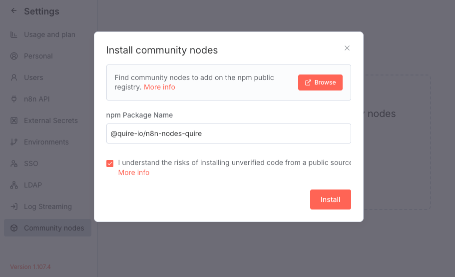

# Quire n8n Node Installation Guide

This guide will walk you through installing and configuring the Quire node for n8n, enabling you to integrate Quire project management with your automation workflows.

## Prerequisites

- A Quire account
- An n8n instance (self-hosted or cloud)
- Administrative access to your n8n instance

## Installation

### 1. Create Your Quire App

To access Quire's API, you'll need to create a Quire app that will provide the necessary authentication credentials.

1. Follow the comprehensive tutorial: [Create Your Own App with Quire API](https://quire.io/blog/p/Create-Your-Quire-App-with-Quire-API.html)
2. Set the **Redirect URL** to https://your-n8n-instance.com/rest/oauth2-credential/callback in your Quire app settings.

**Important**: Do NOT activate "Public Distribution" if this app is for personal use only, as this will make your app visible in the Quire App Directory

### 2. Install the Quire Node in n8n

> **Reference**: [n8n Community Nodes Installation Guide](https://docs.n8n.io/integrations/community-nodes/installation/)

Follow these steps to install the Quire community node:

1. **Access Settings**: Click on your user icon in the top-right corner and select **Settings**

   

2. **Navigate to Community Nodes**: Open the **Community Nodes** tab to manage community node installations

   

3. **Install the Package**: Enter the npm package name [@quire-io/n8n-nodes-quire](https://www.npmjs.com/package/@quire-io/n8n-nodes-quire) and click **Install**

   

4. **Verify Installation**: Once installed, you'll find the Quire node available in your node panel

   

### 3. Configure OAuth2 Credentials

Set up authentication credentials to allow n8n to securely access your Quire account.

1. **Access Credentials**: Navigate to the **Credentials** section in your **Workspace Overview**

   

2. **Create New Credential**: Click **Create credential** and search for **Quire OAuth2 API** in the popup dialog

   

3. **Configure OAuth Settings**:
   - Enter your **Client ID** and **Client Secret** from your Quire app
   - Ensure that the **Redirect URL** in your Quire app matches the **OAuth Redirect URL** displayed in the n8n credential dialog.

   

4. **Authorize Access**: Click **Connect my account** to authorize n8n and select which Quire projects to grant access to

### 4. Configure Webhook URL (For Triggers)

The Quire node includes a **Quire Event Trigger** that can receive real-time updates from your Quire projects.

To enable webhook notifications:

1. **Configure in Quire App**: 
   - Go to your Quire app settings
   - Navigate to the **Webhooks** section
   - Enter your n8n instance host URL (e.g., `https://your-n8n-instance.com`)

   

## Next Steps

Your Quire Node is now configured, you can start using the node in your n8n workflows.
